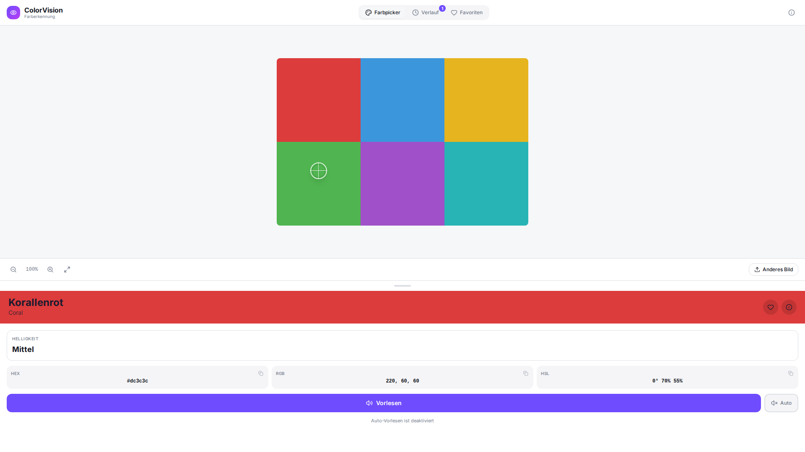
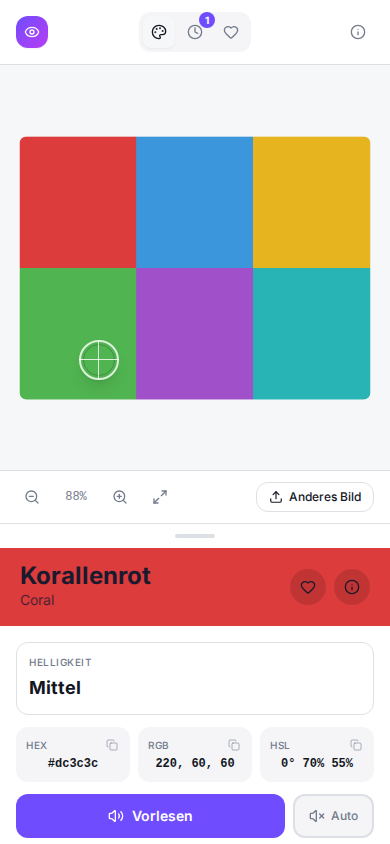
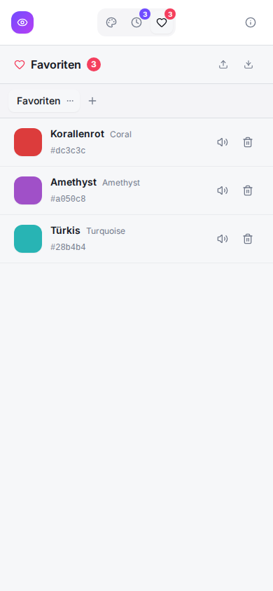
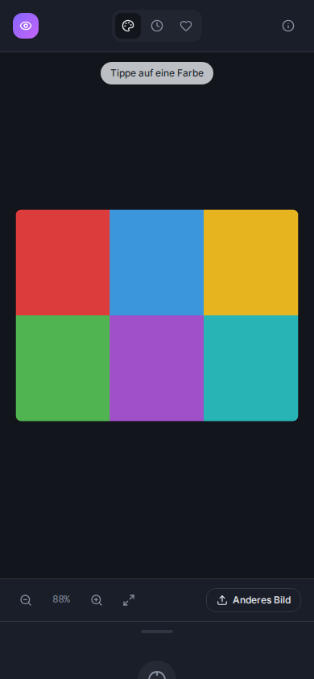

# ColorVision – Farberkennung

> Farben erkennen und benennen – für Menschen mit Farbenfehlsichtigkeit

[](https://github.com/FelixLenz-Code/colorvision/releases/latest)
[](https://creativecommons.org/licenses/by-nc/4.0/deed.de)

---

## Screenshots

**Desktop (1080p)**



**Mobil**

<table>
  <tr>
    <td align="center"><b>Farbe erkannt</b></td>
    <td align="center"><b>Verlauf</b></td>
    <td align="center"><b>Favoriten</b></td>
    <td align="center"><b>Dark Mode</b></td>
  </tr>
  <tr>
    <td></td>
    <td></td>
    <td></td>
    <td></td>
  </tr>
</table>

---

## Features

- **Farberkennung per Tipp** — Bild laden, auf eine Stelle tippen, Farbe sofort identifizieren
- **200+ Farbnamen** — Deutsch und Englisch, mit Helligkeitsbeschreibung
- **Text-to-Speech** — Farbnamen automatisch vorlesen lassen (Deutsch)
- **Auto-Vorlesen** — Jede erkannte Farbe wird sofort vorgelesen
- **Dark Mode** — Helles und dunkles Design, folgt der Systemeinstellung
- **Querformat** — Schiebbare Seitenleiste im Landscape-Modus
- **Verlauf** — Alle erkannten Farben mit Zeitstempel
- **Favoriten** — Farben in benutzerdefinierten Listen organisieren
- **CSV-Import/Export** — Favoritenlisten sichern und übertragen
- **Zoom & Pan** — Mausrad-Zoom und Pinch-to-Zoom auf Touchgeräten
- **PWA** — Installierbar, offline-fähig
- **Desktop-App** — Native Apps für Linux, Windows und macOS

---

## Installation

### Desktop-App (empfohlen)

Lade die passende Datei von der [Releases-Seite](https://github.com/FelixLenz-Code/colorvision/releases/latest) herunter:

| Plattform | Datei |
|-----------|-------|
| 🐧 Linux | `ColorVision-*.AppImage` |
| 🪟 Windows | `ColorVision-*-Setup.exe` |
| 🍎 macOS | `ColorVision-*.dmg` |

**Linux:**
```bash
chmod +x ColorVision-*.AppImage
./ColorVision-*.AppImage
```

### PWA auf eigenem Server hosten

Einzeilige Installation auf Ubuntu/Debian:

```bash
sudo bash -c "$(curl -fsSL https://raw.githubusercontent.com/FelixLenz-Code/colorvision/main/install.sh)"
```

Optionale Parameter:
```bash
sudo bash install.sh --port 8080 --domain meine-domain.de
```

**Update** einer bestehenden Installation:
```bash
sudo bash /opt/colorvision/install.sh
```

### Entwicklungsumgebung

```bash
git clone https://github.com/FelixLenz-Code/colorvision.git
cd colorvision
npm install
npm run dev
```

Für Tests im lokalen Netzwerk (z. B. Tablet):
```bash
npx vite --host 0.0.0.0
```

**Electron (Desktop-Entwicklung):**
```bash
npm run electron:dev
```

**Build:**
```bash
npm run build          # Nur Web (PWA)
npm run electron:build # Web + Desktop-Binaries
```

---

## Tech-Stack

| Bereich | Technologie |
|---------|-------------|
| Frontend | React 18 + TypeScript + Vite |
| Styling | Tailwind CSS |
| Icons | Lucide React |
| Desktop | Electron 42 |
| PWA | vite-plugin-pwa |
| TTS | Web Speech API / espeak-ng |

---

## Hinweis zur KI-Unterstützung

Diese Software wurde vollständig mithilfe von [Claude](https://claude.ai) (einem KI-Assistenten von Anthropic) entwickelt. Der Autor hat die Anforderungen definiert, Entscheidungen getroffen und das Ergebnis geprüft — der Code selbst wurde durch den Dialog mit der KI generiert.

**Haftungsausschluss:** Die Software wird so bereitgestellt, wie sie ist (as-is), ohne jegliche Garantie auf Korrektheit, Vollständigkeit oder Eignung für einen bestimmten Zweck. Der Autor übernimmt keinerlei Haftung für Schäden, Datenverluste oder sonstige Probleme, die durch die Verwendung dieser Software entstehen. Die Nutzung erfolgt auf eigene Verantwortung.

---

## Lizenz

[CC BY-NC 4.0](https://creativecommons.org/licenses/by-nc/4.0/deed.de) — Namensnennung, nicht-kommerziell
